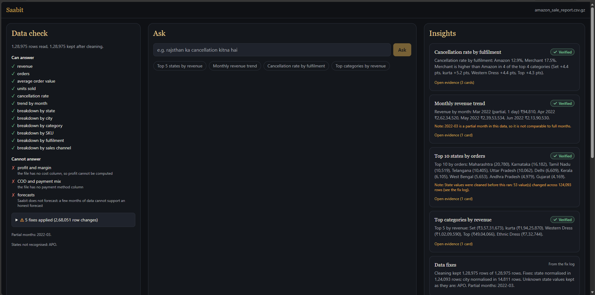
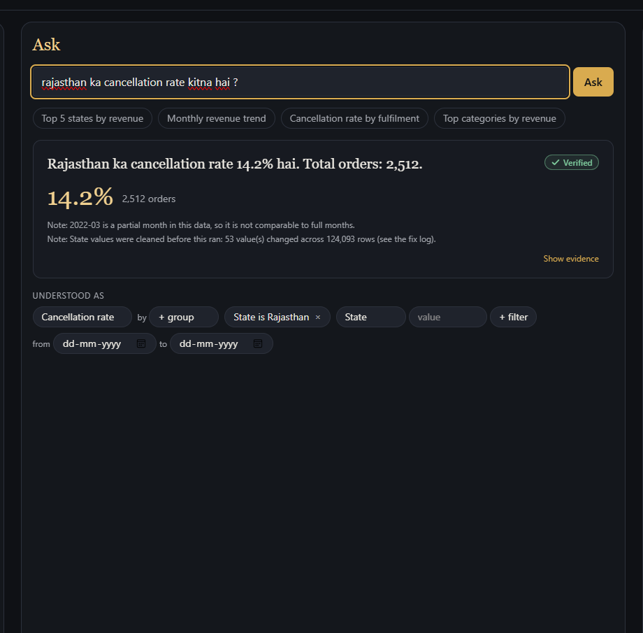
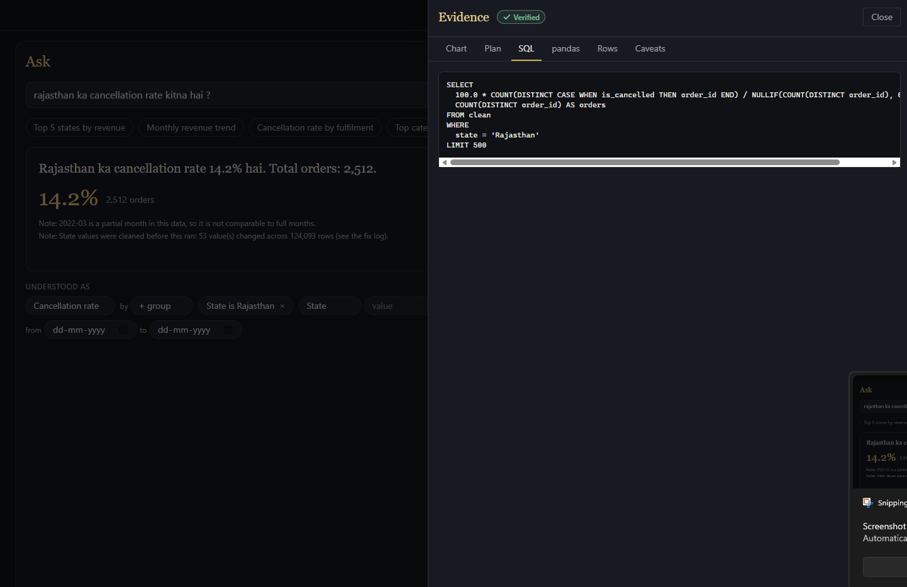
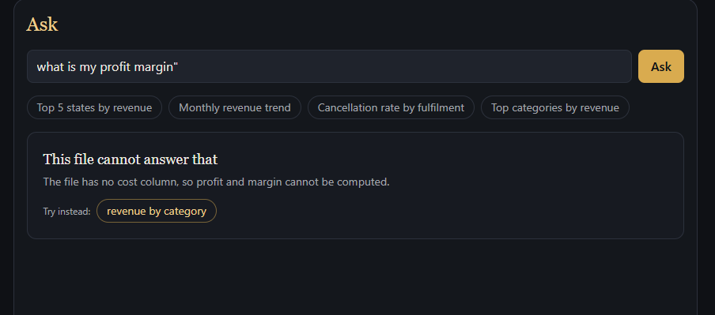
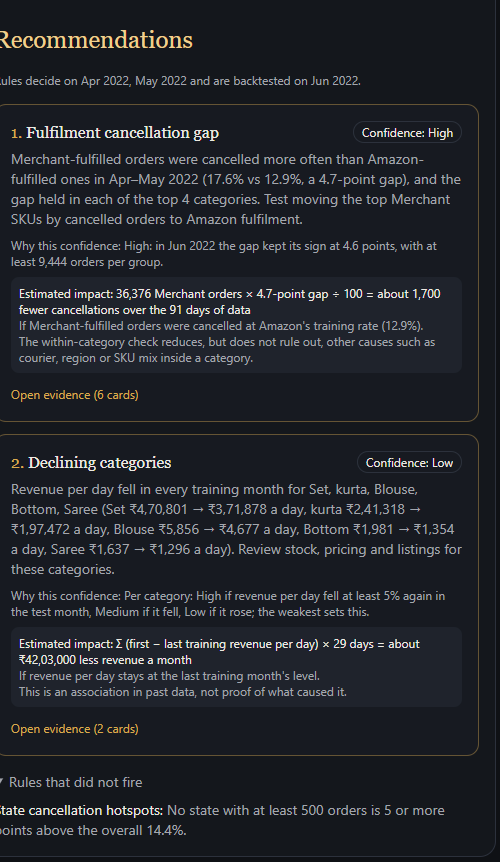

# Saabit

Ask questions about your sales file in plain English or Hinglish, and get numbers that are computed by code, checked by two independent engines, and linked to the rows behind them.

Live: https://saabit.onrender.com (free tier: the first request after a quiet spell can take about a minute while the service wakes up)

[](https://github.com/AnanyaPatel3551/Saabit/actions/workflows/ci.yml)



## Results

### Baseline: Saabit and ChatGPT on the same 20 questions

| | Answerable correct | Unanswerable refused | Total |
| --- | --- | --- | --- |
| Saabit, planner on NVIDIA NIM `nvidia/nemotron-3-super-120b-a12b`, 2 Oct 2026 | 16 / 17 | 3 / 3 | 19 / 20 |
| ChatGPT web app with file upload and code execution (model not recorded), 2 Oct 2026 | 2 / 17 | 2 / 3 | 4 / 20 |

Method: ChatGPT was used in one conversation. The sample CSV was uploaded once and all 20 questions were sent in one message, worded exactly as in `eval/questions.yaml`, with no hints or corrections. One conversation can only help ChatGPT (it can reuse its own earlier work and keep the file loaded), so the comparison is conservative; the PRD's stricter method is one fresh chat per question. Both sides were scored with the same rules (`eval/scoring.py`) against the same independent answer key. The Saabit side is taken from the full eval run of 2 Oct 2026, made with `--no-cache`.

ChatGPT's misses, each reproduced with plain pandas in `eval/baseline/reproduce.py`:

- Revenue included cancelled orders (s01, s03, s05, s08, b09, t01).
- Rows were counted instead of orders (s07, t04, x01, b10).
- State spellings were not merged, such as RJ and Rajsthan for Rajasthan, or Orissa for Odisha (x01, x04, x05, x07).
- The March partial-month warning was missing (x02).
- A forecast was given instead of a refusal (u03).
- One miscount that no reading of the file reproduces (b03).

Saabit's one miss, x07, read "New Delhi" as the city (5,948 orders) instead of the state (6,609).

Full write-up, question by question: [eval/baseline/RESULTS.md](eval/baseline/RESULTS.md). ChatGPT conversation: https://chatgpt.com/share/6abf6a05-3b40-83e8-80b4-279ce6130ea9

### Full eval scorecard

`python eval/eval.py` runs 50 golden questions (40 answerable, 10 that should be refused) and 15 anchors (13 answerable, 2 to refuse). Expected values come from a separate plain-pandas script that never imports the app (`eval/answer_key/questions.py`, `notebooks/golden_answers.ipynb`). Runs use `--no-cache`, so every question goes to the model.

| Run | Answerable correct | Unanswerable refused | Verified but wrong | Anchors correct | Latency p50 / p95 (plan and compute) |
| --- | --- | --- | --- | --- | --- |
| NVIDIA NIM `nvidia/nemotron-3-super-120b-a12b`, 2 Oct 2026 | 38/40 (95%) | 10/10 (100%) | 0 | 13/13 answerable, 2/2 refused | 3.91 s / 25.16 s |
| **Groq `openai/gpt-oss-120b` — final run (pending)** | _pending_ | _pending_ | _pending_ | _pending_ | _pending_ |

Source: `eval/results/latest.json` and `eval/results/latest.md`. The NIM run made 65 planner calls with 0 saved plans. Its two misses, x06 ("Pondicherry revenue") and x07 ("How many orders from New Delhi?"), are both a place name read as a city instead of a state. They are counted as "verified but misread" (2), not as "verified but wrong". "Verified but wrong" counts answers that the two engines agreed on but that differ from the answer key for the same plan.

### Tests

398 backend tests passed and 2 were skipped on 2 Oct 2026 (`eval/results/tests.json`, written by `.\tasks.ps1 test`, which excludes live LLM tests).

## What "Verified" means

Verified means two independent engines, SQL in DuckDB and pandas, ran the same plan and got the same result within rounding tolerance. It catches calculation, compiler and cleaning bugs.

It does not catch a question that was read wrongly. A misread plan gives the same wrong answer in both engines, and both agree. That is why the plan is always shown as editable chips, and why the eval counts "verified but misread" separately.

## How it works

1. **Upload:** a CSV or XLSX file of up to 25 MB, stored unchanged.
2. **Detect:** rules suggest the date, amount, order ID and other columns, and the user confirms them.
3. **Clean:** states, cities, dates and cancellations are normalised, and every change is written to a downloadable fix log.
4. **Plan:** the LLM turns the question into a small JSON plan, which code validates and shows as editable chips.
5. **Compute twice:** the plan runs as SQL in DuckDB (built with sqlglot) and, separately, in pandas.
6. **Verify:** only matching results are marked Verified; otherwise both values are shown.
7. **Answer:** numbers appear first; the LLM's sentence is kept only if every number in it matches the result.
8. **Evidence:** each answer links to its plan, SQL, pandas code, source rows and caveats; insights and recommendations are computed when the file is confirmed.



A Hinglish question answered and Verified, with its caveats and the plan shown as editable chips.



The evidence drawer: the SQL behind the number, next to the plan, the pandas code, the source rows and the caveats.



A question the file cannot answer is refused, with the reason and a nearby question it can answer.



Recommendations, each with its backtest confidence, estimated impact and links to its evidence.

## Design decisions

From the PRD's decision table (`docs/PRD.md`, "Design decisions").

| Decision | Chosen | Rejected | Why |
| --- | --- | --- | --- |
| Who computes numbers | Code only | LLM with code interpreter | LLM-written code makes silent choices; fixed metric code can be unit-tested |
| Question format | Structured JSON plan | Free text-to-SQL | A plan is small, validatable, shown to the user and editable; free SQL is none of these |
| Verification | Two independent engines on one plan | Single engine; LLM self-check | Catches compiler and cleaning bugs cheaply. Limit: a misread question passes both, so the plan is shown to the user |
| Cleaning | Dictionary and logged, reversible fixes | Fuzzy matching or LLM normalisation | Every change is explainable row by row; fuzzy matching can merge different places |
| LLM input | Schema, allowed values, aggregates | Raw rows | Privacy, token cost, and it removes the temptation for the model to calculate |
| Answer text | LLM sentence with a number check, template fallback | Unchecked LLM text | A single hallucinated number would break the whole promise |
| Recommendations | Rules over evidence, with a backtest | LLM brainstorming | Every recommendation is traceable and its confidence is earned, not asserted |
| Out-of-format questions | Refuse with the nearest supported question | Free-form SQL fallback | Not enough time to make free SQL safe and verified; refusal keeps the zero-error promise |

## What building it taught me

- **Two engines cannot catch a wrong column.** With the Status column removed, role detection picked `Courier Status` as the order status. Both engines agreed on the resulting cancellation rate, so the answer was marked Verified. The independent robustness check (`eval/robustness.py`) caught it, not the engines. Header words like "courier" now rule a column out of the status role (`backend/app/core/detect.py`, test `test_courier_status_is_not_suggested_as_the_order_status`).
- **512 MB is small.** The first deploy ran out of memory on Render's 512 MB instance while loading and cleaning the sample at startup. Scanning and cleaning moved to `docker build` (`python -m app.prepare_sample` in the `Dockerfile`), so the running app only reads prepared files. `scripts/memcheck.py` checks each scenario against a 300 MB budget inside a 512 MB container.
- **Providers change under you.** The PRD was written around Llama 3.3 70B on Groq, which Groq retired on 16 Aug 2026. The planner moved to `openai/gpt-oss-120b` on Groq. NVIDIA NIM was added as a fallback for rate limits, server errors and timeouts, using Nemotron 3 Super because NIM does not serve `openai/gpt-oss-120b`.
- **Free tiers have daily limits.** Groq's free tier has a daily token cap, and repeated full eval runs hit it partway through. For scale, the recorded NIM run sent 111,738 prompt tokens over 65 planner calls (`eval/results/latest.json`). Plans are now cached on disk, keyed by prompt version, dataset schema and question, so unchanged questions are not asked again. A seed of checked plans for the example and eval questions is loaded into the image at build time.

## Privacy and data

- **Your file** travels over HTTPS and is stored only on the server. It is deleted after 24 hours, or immediately with "Delete my data now" in the workspace header, which removes the file, its cleaned copy and the evidence behind every answer. The shared sample cannot be deleted.
- **A private key for each upload.** The server returns a random key once, at upload, and keeps only its SHA-256 hash. Only the uploader's browser tab holds the key (in memory and sessionStorage, never in a link), and it is sent in a request header. Without it, nobody can read the file, its answers or its downloads through Saabit: the server answers 404, as if the data did not exist. Closing the tab forgets the key. The shared sample is public and has no key.
- **Saved question plans** (which measure, grouping, filters and dates a question asked for, not rows from your file) are kept for up to 7 days so repeated questions are faster. "Delete my data now" does not remove them.
- **No accounts and no analytics.** The server keeps a technical log of each request (time, path, outcome, duration), never rows, cell values, questions or keys.
- **What the AI provider receives.** Saabit uses Groq, with NVIDIA as a backup, only to read the question and to phrase the answer; every number is computed on the server by code.
  - To plan a question: the question, the kinds of columns the file has (such as state or category), the short lists of allowed values for columns that have few of them (for example state names), and the file's date range.
  - To write the answer sentence: the question and a table of totals Saabit already computed (at most 20 rows).
  - Never raw rows from the file.
- What the providers do with the data they receive is set by their own policies: [Groq](https://groq.com/privacy-policy/) and [NVIDIA](https://www.nvidia.com/en-us/about-nvidia/privacy-policy/).

The same text is on the app's `/privacy` page.

## Limitations and next steps

- **Place names that are both a city and a state.** "New Delhi" and "Pondicherry" can be read either way, and the model picks one silently: x07 on both the baseline and the full eval, and x06 on NIM. The planner should ask instead.
- **Slow fallback.** When Groq is unavailable, NIM answers, but its planner latency in the recorded run was p50 3.91 s and p95 25.16 s. If the sentence does not arrive within 10 seconds, the template sentence is shown.
- **No causal claims.** Recommendations describe associations in past data. The fulfilment rule checks that the gap holds inside each of the top four categories, but other causes such as courier, region or SKU mix remain, and the card says so.
- **Three months of data.** The sample covers 31 Mar to 29 Jun 2022, and March has one day. There is no forecasting, and each backtest uses a single held-out month.
- **One file at a time.** Each dataset is answered on its own; files cannot be combined or compared.
- **Single-process state.** Rate limits (30 questions every 10 minutes and 5 uploads an hour per client) and provider cool-downs are kept in memory. A restart resets them, and more than one worker would count separately.
- **No accounts.** An upload is tied to the browser tab that made it: once the tab is closed, its key is gone and the file must be uploaded again. Storage is the container's local disk, so a redeploy removes everything except the bundled sample.
- **Other known gaps** (from `docs/LATER.md`):
  - the cancelled rule is literal (Status exactly "Cancelled"), so "voided" or "refunded" count as 0% cancelled;
  - CSV downloads do not neutralise cells that start with `=`, `+`, `-` or `@`;
  - city spellings beyond case and spaces (Bangalore and Bengaluru) are not merged;
  - the second-file demo and a browser end-to-end test are not done;
  - an LLM sentence can use a wrong word such as "peak" with correct numbers;
  - the sample's licence should be confirmed with its author before the repository is made public.

## Run it locally

Windows, PowerShell, Python 3.11, Node 22 or later.

```powershell
git clone https://github.com/AnanyaPatel3551/Saabit.git
cd Saabit

# If scripts are blocked: Set-ExecutionPolicy -Scope CurrentUser RemoteSigned
py -3.11 -m venv backend\.venv
backend\.venv\Scripts\python.exe -m pip install -r backend\requirements.txt
cd frontend; npm ci; cd ..

# API keys: copy the example and fill in GROQ_API_KEY (and NIM_API_KEY for the fallback)
Copy-Item .env.example .env
notepad .env

# Prepare the sample (the Docker image does this at build time)
cd backend; .\.venv\Scripts\python.exe -m app.prepare_sample; cd ..

# Tests: backend (live LLM tests are excluded), eval rubric, frontend
.\tasks.ps1 test
backend\.venv\Scripts\python.exe -m pytest eval\tests -q
cd frontend; npm test; cd ..

# Run the app: two terminals, then open http://localhost:5173
.\tasks.ps1 dev-backend
.\tasks.ps1 dev-frontend

# Check both LLM providers (uses one small call each)
cd backend
Get-Content ..\.env | ForEach-Object { if ($_ -match '^([A-Za-z_]+)=(.+)$') { Set-Item "Env:$($Matches[1])" $Matches[2] } }
.\.venv\Scripts\python.exe -m app.cli llm-check
cd ..

# Eval (uses a large share of Groq's daily free tokens), then robustness checks
.\tasks.ps1 eval --no-cache
.\tasks.ps1 eval --provider nim --no-cache    # the NIM fallback instead
.\tasks.ps1 eval --only s01 x01 u01           # a few questions; saved as eval\results\partial.*

# Score the manual baseline (writes eval\results\baseline.json)
backend\.venv\Scripts\python.exe eval\baseline\score_baseline.py eval\baseline\baseline_template.csv
```

Live LLM tests run only on request (`.\tasks.ps1 test-live`) because they spend the provider's rate limit.

Docker, as deployed (then open http://localhost:8000):

```powershell
docker build -t saabit .; docker run --rm -p 8000:8000 -e PORT=8000 --env-file .env saabit
```

## Data

The sample is the "E-Commerce Sales Dataset" (`Amazon Sale Report.csv`): 128,975 rows and 120,378 unique orders from 31 Mar to 29 Jun 2022. It is published on Kaggle by The Devastator (https://www.kaggle.com/datasets/thedevastator/unlock-profits-with-e-commerce-sales-data), from an original source by ANil (https://data.world/anilsharma87).

Licence: Kaggle lists it as "Other (specified in description)", and the description asks only that the original authors be credited. No licence text explicitly grants or forbids redistribution (checked 30 Sep 2026); see `data/sample/README.md`.

Credit: Data from the "E-Commerce Sales Dataset" by ANil (data.world/anilsharma87), published on Kaggle by The Devastator.

A second, **synthetic** sample (`data/sample_shopify/shopify_synthetic.csv`) shows a differently shaped export: Shopify-style headers (`Order Number`, `Created at`, `Total`, `Financial Status`, `Shipping Province`) and DD/MM/YYYY dates. Every row is made up by `data/sample_shopify/make_synthetic.py` from a fixed seed; it is not real sales data. The app labels it "Synthetic data", and it goes through the normal confirm screen ("Try a different file format" on the landing page).

## How it was built

Designed, specified and evaluated by me; implemented with AI-assisted coding (Claude Code); every change reviewed and tested.
